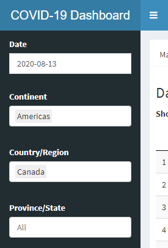
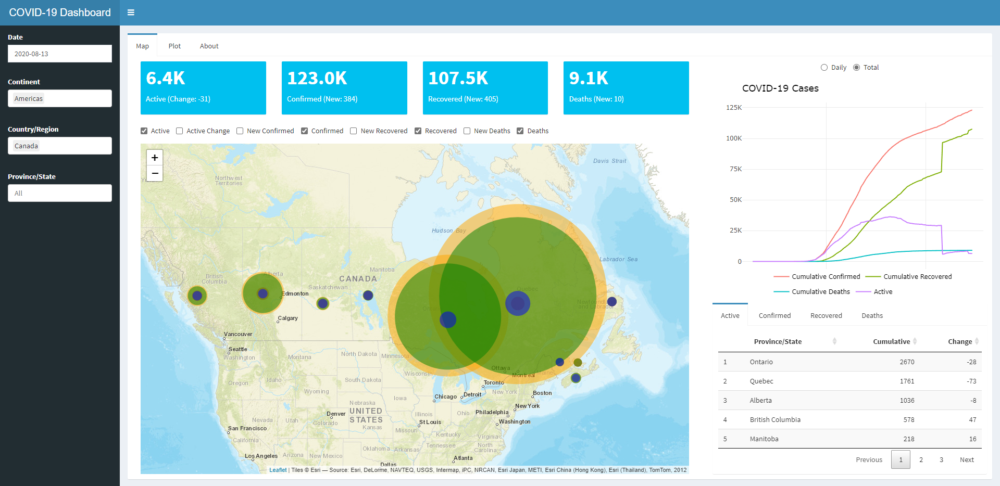
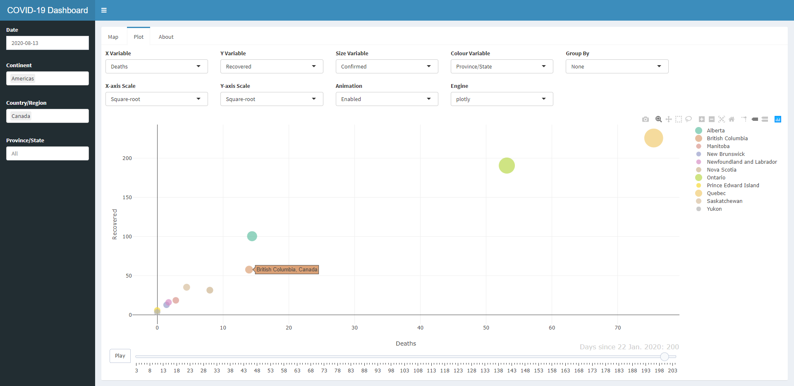
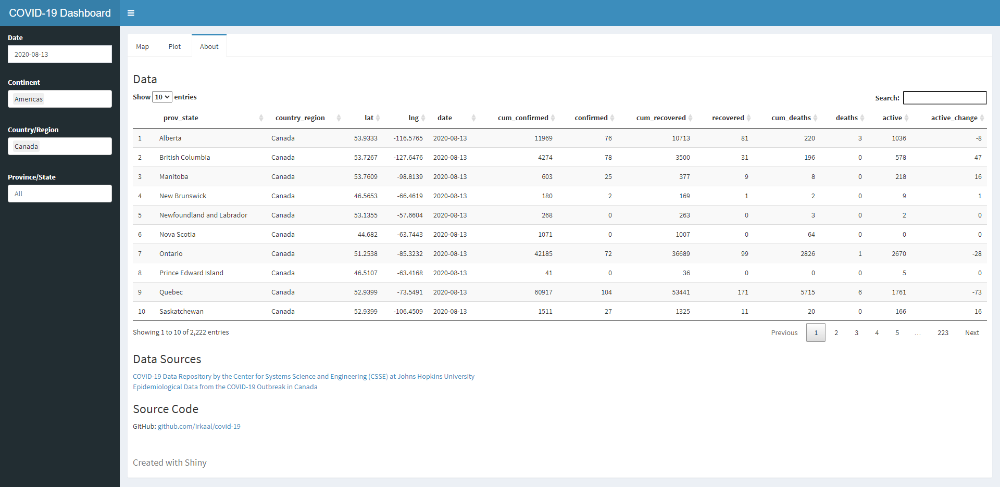

# COVID-19 Dashboard
A data dashboard for tracking and visualizing the spread of COVID-19 around the world.


## Access
[`irkaal.shinyapps.io/covid-19`](https://irkaal.shinyapps.io/covid-19)


## Application

### Sidebar


The dashboard `sidebar` provides different dropdowns for filtering the input data for each tab section. In other words, each dropdown will affect the data visualized in each tab section.

### Map


The `map` section provides a summary of the pandemic through the four value boxes displaying case counts, an interactive leaflet map with customizable case selection, a scatter plot with daily or total mode, and a data table for each case category.

### Plot


The `plot` section provides an interface for visualizing the cases data with customizable axis variables, color variable, size variable, grouping feature, axis scaling options, ggplot2 and plotly support for static plots, and plotly animated plots.

It is recommended to disable animation while changing the filter as they are applied immediately.

### About


The `about` section provides information about the data source and source code. Additionally, a data table showing the processed data used by the application is also displayed.

### Data
```r
server <- function(input, output, session) {
  ...
  data <- reactive({
    invalidateLater(12 * 3600 * 1000, session)
    withProgress(message = 'Loading...', value = 0, {
      processed <- covid_data()
      incProgress(1)
    })
    processed
  })
  ...
})
```
Only data from the day before can be visualized as the data sources are being updated at different times.
Application will invalidate the currently loaded data every 12 hours. This ensures that the data stays up to date.


## Data Sources
| Data | Source |
|------|--------|
| Global Cases | [Johns Hopkins University](https://github.com/CSSEGISandData/COVID-19) |
| Canadian Cases | [COVID-19 Canada Open Data Working Group](https://github.com/ishaberry/Covid19Canada/) |
