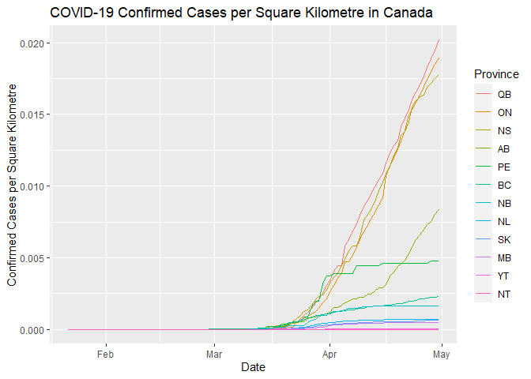
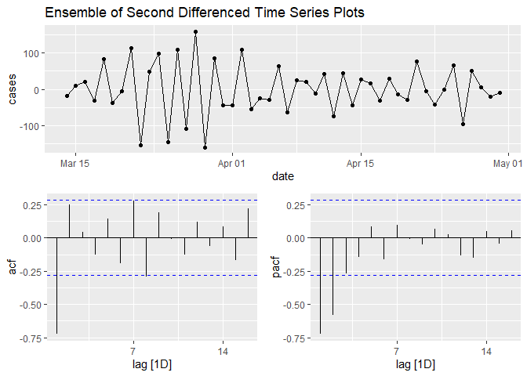

# COVID-19 Time Series and Forecasting

## Notebook
- [Markdown](notebook/covid-19.md)
- [R Markdown](notebook/covid-19.Rmd)

## Data Collection
| Data | Source |
|------|--------|
| Cases | [Johns Hopkins University](https://github.com/CSSEGISandData/COVID-19) |
| Population | [Statistics Canada](https://www150.statcan.gc.ca/t1/tbl1/en/tv.action?pid=1710000901) |
| Land Area | [Statistics Canada](https://www150.statcan.gc.ca/n1/pub/11-402-x/2010000/chap/geo/tbl/tbl07-eng.htm) |

## Data Cleaning
The raw data is generally in a good shape except for the `recovered` cases data. It seems to be missing cases count for each Canadian province. To ensure that all three data (`confirmed`, `recovered`, and `deaths`) are consistent, I combined all the cases counts in Canada into a single observation which represents the whole of Canada for `confirmed` and `deaths` data.

## Exploratory Data Analysis
This EDA can be found in the notebook link above. I looked at the distributions of cases in each Canadian province and explored how they differ when taking population density into account. Here are some highlights.

Next, I trained an ARIMA model to forecast future cases count in British Columbia. Here are some highlights.

NOTE: A time series model like ARIMA is not the best choice for forecasting a pandemic. One reason would be misleading data as we know that the current counts are underestimating the real counts. There are compartmental epidemiological models (e.g. SIR model) that have been trained and tested with data from past pandemics that model the actual infection process. The purpose of this ARIMA modeling section is to demonstrate how to use it to forecast future values on the series and should not be considered as an accurate or reliable forecast.

## Model Building
For building the ARIMA model and performing residual analysis, I used the packages from `tidyverts`. To evaluate the models, I used Time Series Cross Validation to calculate the validation RMSE and chose the best model as the one with the lowest score.

## Model Performance

| Model | TSCV RMSE |
|-------|---------------------|
| ARIMA(4,2,0) | 37.0 |
| ARIMA(2,2,0) | 39.0 |
| ARIMA(3,2,0) | 40.1 |
| ARIMA(4,2,1) | 44.9 |
| ARIMA(2,2,4) | 45.9 |

