COVID-19 Time Series and Forecasting
================

## Objective

In this project, I will perform a time series analysis on COVID-19
confirmed cases around the world and forecast the spread.

## Setup

``` r
library(tidyverse)
library(lubridate)
library(scales)
library(fable)
library(feasts)
library(ggfortify)
library(here)
library(tseries)
library(tsibble)
```

## Load Data

The data that I will be using was obtained from [Johns Hopkins
University](https://github.com/CSSEGISandData/COVID-19).

``` r
confirmed <- read_csv(here("forecast/data/raw/confirmed.csv"))
```

    ## Parsed with column specification:
    ## cols(
    ##   .default = col_double(),
    ##   `Province/State` = col_character(),
    ##   `Country/Region` = col_character()
    ## )

    ## See spec(...) for full column specifications.

``` r
head(confirmed)
```

    ## # A tibble: 6 x 104
    ##   `Province/State` `Country/Region`   Lat   Long `1/22/20` `1/23/20` `1/24/20`
    ##   <chr>            <chr>            <dbl>  <dbl>     <dbl>     <dbl>     <dbl>
    ## 1 <NA>             Afghanistan       33    65            0         0         0
    ## 2 <NA>             Albania           41.2  20.2          0         0         0
    ## 3 <NA>             Algeria           28.0   1.66         0         0         0
    ## 4 <NA>             Andorra           42.5   1.52         0         0         0
    ## 5 <NA>             Angola           -11.2  17.9          0         0         0
    ## 6 <NA>             Antigua and Bar~  17.1 -61.8          0         0         0
    ## # ... with 97 more variables: `1/25/20` <dbl>, `1/26/20` <dbl>,
    ## #   `1/27/20` <dbl>, `1/28/20` <dbl>, `1/29/20` <dbl>, `1/30/20` <dbl>,
    ## #   `1/31/20` <dbl>, `2/1/20` <dbl>, `2/2/20` <dbl>, `2/3/20` <dbl>,
    ## #   `2/4/20` <dbl>, `2/5/20` <dbl>, `2/6/20` <dbl>, `2/7/20` <dbl>,
    ## #   `2/8/20` <dbl>, `2/9/20` <dbl>, `2/10/20` <dbl>, `2/11/20` <dbl>,
    ## #   `2/12/20` <dbl>, `2/13/20` <dbl>, `2/14/20` <dbl>, `2/15/20` <dbl>,
    ## #   `2/16/20` <dbl>, `2/17/20` <dbl>, `2/18/20` <dbl>, `2/19/20` <dbl>,
    ## #   `2/20/20` <dbl>, `2/21/20` <dbl>, `2/22/20` <dbl>, `2/23/20` <dbl>,
    ## #   `2/24/20` <dbl>, `2/25/20` <dbl>, `2/26/20` <dbl>, `2/27/20` <dbl>,
    ## #   `2/28/20` <dbl>, `2/29/20` <dbl>, `3/1/20` <dbl>, `3/2/20` <dbl>,
    ## #   `3/3/20` <dbl>, `3/4/20` <dbl>, `3/5/20` <dbl>, `3/6/20` <dbl>,
    ## #   `3/7/20` <dbl>, `3/8/20` <dbl>, `3/9/20` <dbl>, `3/10/20` <dbl>,
    ## #   `3/11/20` <dbl>, `3/12/20` <dbl>, `3/13/20` <dbl>, `3/14/20` <dbl>,
    ## #   `3/15/20` <dbl>, `3/16/20` <dbl>, `3/17/20` <dbl>, `3/18/20` <dbl>,
    ## #   `3/19/20` <dbl>, `3/20/20` <dbl>, `3/21/20` <dbl>, `3/22/20` <dbl>,
    ## #   `3/23/20` <dbl>, `3/24/20` <dbl>, `3/25/20` <dbl>, `3/26/20` <dbl>,
    ## #   `3/27/20` <dbl>, `3/28/20` <dbl>, `3/29/20` <dbl>, `3/30/20` <dbl>,
    ## #   `3/31/20` <dbl>, `4/1/20` <dbl>, `4/2/20` <dbl>, `4/3/20` <dbl>,
    ## #   `4/4/20` <dbl>, `4/5/20` <dbl>, `4/6/20` <dbl>, `4/7/20` <dbl>,
    ## #   `4/8/20` <dbl>, `4/9/20` <dbl>, `4/10/20` <dbl>, `4/11/20` <dbl>,
    ## #   `4/12/20` <dbl>, `4/13/20` <dbl>, `4/14/20` <dbl>, `4/15/20` <dbl>,
    ## #   `4/16/20` <dbl>, `4/17/20` <dbl>, `4/18/20` <dbl>, `4/19/20` <dbl>,
    ## #   `4/20/20` <dbl>, `4/21/20` <dbl>, `4/22/20` <dbl>, `4/23/20` <dbl>,
    ## #   `4/24/20` <dbl>, `4/25/20` <dbl>, `4/26/20` <dbl>, `4/27/20` <dbl>,
    ## #   `4/28/20` <dbl>, `4/29/20` <dbl>, `4/30/20` <dbl>

### Data Cleaning

``` r
map_df(confirmed, ~sum(is.na(.)))
```

    ## # A tibble: 1 x 104
    ##   `Province/State` `Country/Region`   Lat  Long `1/22/20` `1/23/20` `1/24/20`
    ##              <int>            <int> <int> <int>     <int>     <int>     <int>
    ## 1              184                0     0     0         0         0         0
    ## # ... with 97 more variables: `1/25/20` <int>, `1/26/20` <int>,
    ## #   `1/27/20` <int>, `1/28/20` <int>, `1/29/20` <int>, `1/30/20` <int>,
    ## #   `1/31/20` <int>, `2/1/20` <int>, `2/2/20` <int>, `2/3/20` <int>,
    ## #   `2/4/20` <int>, `2/5/20` <int>, `2/6/20` <int>, `2/7/20` <int>,
    ## #   `2/8/20` <int>, `2/9/20` <int>, `2/10/20` <int>, `2/11/20` <int>,
    ## #   `2/12/20` <int>, `2/13/20` <int>, `2/14/20` <int>, `2/15/20` <int>,
    ## #   `2/16/20` <int>, `2/17/20` <int>, `2/18/20` <int>, `2/19/20` <int>,
    ## #   `2/20/20` <int>, `2/21/20` <int>, `2/22/20` <int>, `2/23/20` <int>,
    ## #   `2/24/20` <int>, `2/25/20` <int>, `2/26/20` <int>, `2/27/20` <int>,
    ## #   `2/28/20` <int>, `2/29/20` <int>, `3/1/20` <int>, `3/2/20` <int>,
    ## #   `3/3/20` <int>, `3/4/20` <int>, `3/5/20` <int>, `3/6/20` <int>,
    ## #   `3/7/20` <int>, `3/8/20` <int>, `3/9/20` <int>, `3/10/20` <int>,
    ## #   `3/11/20` <int>, `3/12/20` <int>, `3/13/20` <int>, `3/14/20` <int>,
    ## #   `3/15/20` <int>, `3/16/20` <int>, `3/17/20` <int>, `3/18/20` <int>,
    ## #   `3/19/20` <int>, `3/20/20` <int>, `3/21/20` <int>, `3/22/20` <int>,
    ## #   `3/23/20` <int>, `3/24/20` <int>, `3/25/20` <int>, `3/26/20` <int>,
    ## #   `3/27/20` <int>, `3/28/20` <int>, `3/29/20` <int>, `3/30/20` <int>,
    ## #   `3/31/20` <int>, `4/1/20` <int>, `4/2/20` <int>, `4/3/20` <int>,
    ## #   `4/4/20` <int>, `4/5/20` <int>, `4/6/20` <int>, `4/7/20` <int>,
    ## #   `4/8/20` <int>, `4/9/20` <int>, `4/10/20` <int>, `4/11/20` <int>,
    ## #   `4/12/20` <int>, `4/13/20` <int>, `4/14/20` <int>, `4/15/20` <int>,
    ## #   `4/16/20` <int>, `4/17/20` <int>, `4/18/20` <int>, `4/19/20` <int>,
    ## #   `4/20/20` <int>, `4/21/20` <int>, `4/22/20` <int>, `4/23/20` <int>,
    ## #   `4/24/20` <int>, `4/25/20` <int>, `4/26/20` <int>, `4/27/20` <int>,
    ## #   `4/28/20` <int>, `4/29/20` <int>, `4/30/20` <int>

Looks like we have some missing Province/State values and there are no
missing coordinates or case count values, we will not perform any data
imputation.

First, let’s filter the data to only include Canadian cases.

``` r
confirmed <- filter(confirmed, `Country/Region` == "Canada")
select(confirmed, 1:4)
```

    ## # A tibble: 15 x 4
    ##    `Province/State`          `Country/Region`   Lat   Long
    ##    <chr>                     <chr>            <dbl>  <dbl>
    ##  1 Alberta                   Canada            53.9 -117. 
    ##  2 British Columbia          Canada            49.3 -123. 
    ##  3 Grand Princess            Canada            37.6 -123. 
    ##  4 Manitoba                  Canada            53.8  -98.8
    ##  5 New Brunswick             Canada            46.6  -66.5
    ##  6 Newfoundland and Labrador Canada            53.1  -57.7
    ##  7 Nova Scotia               Canada            44.7  -63.7
    ##  8 Ontario                   Canada            51.3  -85.3
    ##  9 Prince Edward Island      Canada            46.5  -63.4
    ## 10 Quebec                    Canada            52.9  -73.5
    ## 11 Saskatchewan              Canada            52.9 -106. 
    ## 12 Diamond Princess          Canada             0      0  
    ## 13 Recovered                 Canada             0      0  
    ## 14 Northwest Territories     Canada            64.8 -125. 
    ## 15 Yukon                     Canada            64.3 -135

Let’s look at all the Provinces/State values.

``` r
pull(confirmed, `Province/State`)
```

    ##  [1] "Alberta"                   "British Columbia"         
    ##  [3] "Grand Princess"            "Manitoba"                 
    ##  [5] "New Brunswick"             "Newfoundland and Labrador"
    ##  [7] "Nova Scotia"               "Ontario"                  
    ##  [9] "Prince Edward Island"      "Quebec"                   
    ## [11] "Saskatchewan"              "Diamond Princess"         
    ## [13] "Recovered"                 "Northwest Territories"    
    ## [15] "Yukon"

Everything looks fine except for Diamond Princess, Grand Princess, and
Recovered. Let’s remove them from our data.

``` r
confirmed <- filter(confirmed, !`Province/State` %in% c("Diamond Princess", "Grand Princess", "Recovered"))
select(confirmed, 1:4)
```

    ## # A tibble: 12 x 4
    ##    `Province/State`          `Country/Region`   Lat   Long
    ##    <chr>                     <chr>            <dbl>  <dbl>
    ##  1 Alberta                   Canada            53.9 -117. 
    ##  2 British Columbia          Canada            49.3 -123. 
    ##  3 Manitoba                  Canada            53.8  -98.8
    ##  4 New Brunswick             Canada            46.6  -66.5
    ##  5 Newfoundland and Labrador Canada            53.1  -57.7
    ##  6 Nova Scotia               Canada            44.7  -63.7
    ##  7 Ontario                   Canada            51.3  -85.3
    ##  8 Prince Edward Island      Canada            46.5  -63.4
    ##  9 Quebec                    Canada            52.9  -73.5
    ## 10 Saskatchewan              Canada            52.9 -106. 
    ## 11 Northwest Territories     Canada            64.8 -125. 
    ## 12 Yukon                     Canada            64.3 -135

To simplify the plots, we will abbreviate the `Province` names and
rename `Province/State` to `Province` and drop the following columns:
`Country/Region`, `Lat`, and `Long`.

``` r
confirmed <- confirmed %>%
  select(-c(`Country/Region`, Lat, Long)) %>%
  rename(Province = `Province/State`) %>%
  mutate(
    Province = factor(
      recode(
        Province,
        "Alberta" = "AB",
        "British Columbia" = "BC",
        "Manitoba" = "MB",
        "New Brunswick" = "NB",
        "Newfoundland and Labrador" = "NL",
        "Nova Scotia" = "NS",
        "Ontario" = "ON",
        "Prince Edward Island" = "PE",
        "Quebec" = "QB",
        "Saskatchewan" = "SK",
        "Northwest Territories" = "NT",
        "Yukon" = "YT"
      )
    )
  )
select(confirmed, 1:4)
```

    ## # A tibble: 12 x 4
    ##    Province `1/22/20` `1/23/20` `1/24/20`
    ##    <fct>        <dbl>     <dbl>     <dbl>
    ##  1 AB               0         0         0
    ##  2 BC               0         0         0
    ##  3 MB               0         0         0
    ##  4 NB               0         0         0
    ##  5 NL               0         0         0
    ##  6 NS               0         0         0
    ##  7 ON               0         0         0
    ##  8 PE               0         0         0
    ##  9 QB               0         0         0
    ## 10 SK               0         0         0
    ## 11 NT               0         0         0
    ## 12 YT               0         0         0

``` r
names(confirmed)
```

    ##   [1] "Province" "1/22/20"  "1/23/20"  "1/24/20"  "1/25/20"  "1/26/20" 
    ##   [7] "1/27/20"  "1/28/20"  "1/29/20"  "1/30/20"  "1/31/20"  "2/1/20"  
    ##  [13] "2/2/20"   "2/3/20"   "2/4/20"   "2/5/20"   "2/6/20"   "2/7/20"  
    ##  [19] "2/8/20"   "2/9/20"   "2/10/20"  "2/11/20"  "2/12/20"  "2/13/20" 
    ##  [25] "2/14/20"  "2/15/20"  "2/16/20"  "2/17/20"  "2/18/20"  "2/19/20" 
    ##  [31] "2/20/20"  "2/21/20"  "2/22/20"  "2/23/20"  "2/24/20"  "2/25/20" 
    ##  [37] "2/26/20"  "2/27/20"  "2/28/20"  "2/29/20"  "3/1/20"   "3/2/20"  
    ##  [43] "3/3/20"   "3/4/20"   "3/5/20"   "3/6/20"   "3/7/20"   "3/8/20"  
    ##  [49] "3/9/20"   "3/10/20"  "3/11/20"  "3/12/20"  "3/13/20"  "3/14/20" 
    ##  [55] "3/15/20"  "3/16/20"  "3/17/20"  "3/18/20"  "3/19/20"  "3/20/20" 
    ##  [61] "3/21/20"  "3/22/20"  "3/23/20"  "3/24/20"  "3/25/20"  "3/26/20" 
    ##  [67] "3/27/20"  "3/28/20"  "3/29/20"  "3/30/20"  "3/31/20"  "4/1/20"  
    ##  [73] "4/2/20"   "4/3/20"   "4/4/20"   "4/5/20"   "4/6/20"   "4/7/20"  
    ##  [79] "4/8/20"   "4/9/20"   "4/10/20"  "4/11/20"  "4/12/20"  "4/13/20" 
    ##  [85] "4/14/20"  "4/15/20"  "4/16/20"  "4/17/20"  "4/18/20"  "4/19/20" 
    ##  [91] "4/20/20"  "4/21/20"  "4/22/20"  "4/23/20"  "4/24/20"  "4/25/20" 
    ##  [97] "4/26/20"  "4/27/20"  "4/28/20"  "4/29/20"  "4/30/20"

The column names after `Province` are dates. These column names
represent the values of the date variable and each row represents 100
observations, not one. Let’s gather those columns into two new columns,
`date` and `cases`. Some might say this is a conversion from a wide
format data into a long format data.

``` r
confirmed <- pivot_longer(confirmed, -Province, names_to = "date", values_to = "cases")
head(confirmed)
```

    ## # A tibble: 6 x 3
    ##   Province date    cases
    ##   <fct>    <chr>   <dbl>
    ## 1 AB       1/22/20     0
    ## 2 AB       1/23/20     0
    ## 3 AB       1/24/20     0
    ## 4 AB       1/25/20     0
    ## 5 AB       1/26/20     0
    ## 6 AB       1/27/20     0

Next, let’s convert the `date` column data type from `<chr>` to `<date>`
and `cases` from `<dbl>` to `<int>`.

``` r
confirmed <- mutate(
  confirmed,
  date = as_date(date, format = "%m/%d/%y"),
  cases = as.integer(cases),
)
head(confirmed)
```

    ## # A tibble: 6 x 3
    ##   Province date       cases
    ##   <fct>    <date>     <int>
    ## 1 AB       2020-01-22     0
    ## 2 AB       2020-01-23     0
    ## 3 AB       2020-01-24     0
    ## 4 AB       2020-01-25     0
    ## 5 AB       2020-01-26     0
    ## 6 AB       2020-01-27     0

Next, let’s convert our data type from `tibble` into `tsibble`.

``` r
confirmed <- as_tsibble(confirmed, index = date, key = Province, validate = F)
head(confirmed)
```

    ## # A tsibble: 6 x 3 [1D]
    ## # Key:       Province [1]
    ##   Province date       cases
    ##   <fct>    <date>     <int>
    ## 1 AB       2020-01-22     0
    ## 2 AB       2020-01-23     0
    ## 3 AB       2020-01-24     0
    ## 4 AB       2020-01-25     0
    ## 5 AB       2020-01-26     0
    ## 6 AB       2020-01-27     0

## Exploratory Data Analysis

In this section, I will explore the COVID-19 data related to cases in
Canada.

### Distribution by Province

``` r
confirmed %>%
  filter(date == mdy("4/30/20")) %>%
  mutate(Province = fct_reorder(Province, cases, .desc = T)) %>%
  ggplot(aes(x = reorder(Province, cases), y = cases)) +
  geom_bar(aes(color = Province, fill = Province), stat = "identity") +
  labs(
    title = "COVID-19 Confirmed Cases in Canada",
    x = NULL,
    y = "Confirmed Cases"
  ) +
  theme(legend.position = "none") +
  scale_y_continuous(labels = label_number_si()) +
  coord_flip()
```

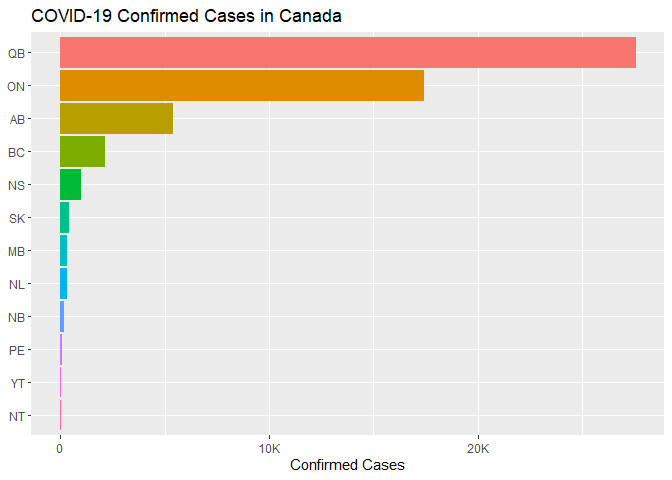<!-- -->

Let’s log-transform the data

``` r
confirmed %>%
  filter(date == mdy("4/30/20")) %>%
  mutate(Province = fct_reorder(Province, cases, .desc = T)) %>%
  ggplot(aes(x = reorder(Province, cases), y = cases)) +
  geom_bar(aes(color = Province, fill = Province), stat = "identity") +
  labs(
    title = "COVID-19 Confirmed Cases in Canada",
    x = NULL,
    y = "Confirmed Cases (Logarithmic)"
  ) +
  theme(legend.position = "none") +
  coord_flip() +
  scale_y_log10()
```

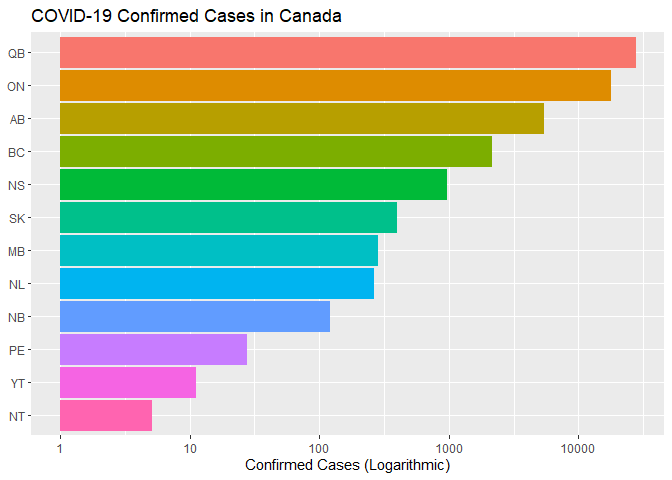<!-- -->

Even though it’s less representative of the real data, with this
log-transformed data, we can better compare the counts between
provinces. We can see that Quebec has the highest count, followed by
Ontario, Alberta, and British Columbia.

### Confirmed Cases

``` r
confirmed %>%
  mutate(Province = fct_reorder2(Province, date, cases)) %>%
  ggplot(aes(x = date, y = cases)) +
  geom_line(aes(color = Province)) +
  labs(
    title = "COVID-19 Confirmed Cases in Canada",
    x = "Date",
    y = "Confirmed Cases"
  ) +
  scale_y_continuous(labels = label_number_si())
```

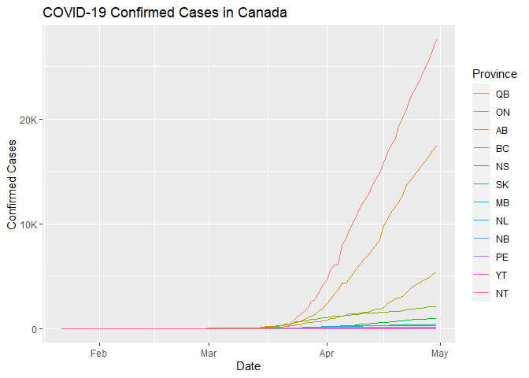<!-- -->

Once again, let’s look at the log-transformed plot.

``` r
confirmed %>%
  mutate(Province = fct_reorder2(Province, date, cases)) %>%
  ggplot(aes(x = date, y = cases)) +
  geom_line(aes(color = Province)) +
  labs(
    title = "COVID-19 Confirmed Cases in Canada",
    x = "Date",
    y = "Confirmed Cases (Logarithmic)"
  ) +
  scale_y_log10()
```

    ## Warning: Transformation introduced infinite values in continuous y-axis

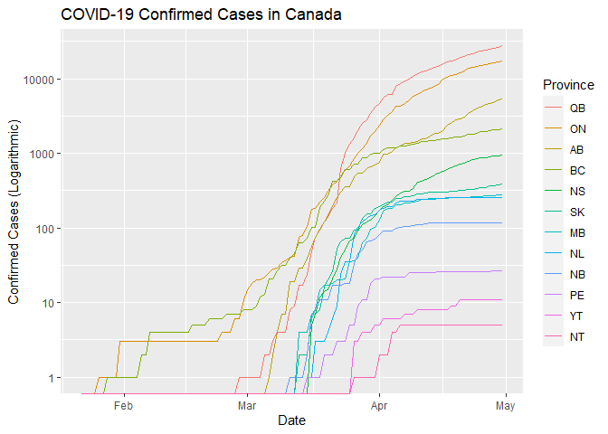<!-- -->

From the log-transformed plot, we can see that the first case in Canada
was observed in Ontario, followed by British Columbia and Quebec. Looks
like British Columbia is handling the spread in the region pretty well
compared to other provinces. This is evident from the trends shown by
other provinces like Quebec and Alberta. This is likely due to the
earlier response to the virus initiated by the BC government.

Looking at the trend on the log-transformed plot, we can see the
exponentially increasing rate in March until mid to end of March where
most provinces start to show a lower rate or close to a linear rate in
spread. Additionally, we can also see that provinces like Quebec,
Ontario, Alberta, and Nova Scotia are still showing a higher rate
compared to other provinces in late April.

I would also like to note that the population of each province in Canada
can differ greatly. For example, the population of Prince Edward Island
(PE) only has around 140-150 thousand while provinces like Ontario has a
population of over 14 million people. Additionally, we can also take
into account the density for each province. I will explore this in the
next section.

### How population and land area affects spread

I will be using population data from [Statistics
Canada](https://www150.statcan.gc.ca/t1/tbl1/en/tv.action?pid=1710000901).

#### Population Data

``` r
population <- read_csv(here("forecast/data/raw/population.csv"))
```

    ## Parsed with column specification:
    ## cols(
    ##   REF_DATE = col_character(),
    ##   GEO = col_character(),
    ##   DGUID = col_character(),
    ##   UOM = col_character(),
    ##   UOM_ID = col_double(),
    ##   SCALAR_FACTOR = col_character(),
    ##   SCALAR_ID = col_double(),
    ##   VECTOR = col_character(),
    ##   COORDINATE = col_double(),
    ##   VALUE = col_double(),
    ##   STATUS = col_logical(),
    ##   SYMBOL = col_logical(),
    ##   TERMINATED = col_logical(),
    ##   DECIMALS = col_double()
    ## )

``` r
population <- population %>%
  filter(REF_DATE == "2020-01" & !GEO %in% c("Canada", "Nunavut")) %>%
  mutate(
    Province = factor(
      recode(
        GEO,
        "Alberta" = "AB",
        "British Columbia" = "BC",
        "Manitoba" = "MB",
        "New Brunswick" = "NB",
        "Newfoundland and Labrador" = "NL",
        "Nova Scotia" = "NS",
        "Ontario" = "ON",
        "Prince Edward Island" = "PE",
        "Quebec" = "QB",
        "Saskatchewan" = "SK",
        "Northwest Territories" = "NT",
        "Yukon" = "YT"
      )
    ),
    Population = VALUE,
  ) %>%
  select(Province, Population) %>%
  arrange(desc(Population))
head(population)
```

    ## # A tibble: 6 x 2
    ##   Province Population
    ##   <fct>         <dbl>
    ## 1 ON         14711827
    ## 2 QB          8537674
    ## 3 BC          5110917
    ## 4 AB          4413146
    ## 5 MB          1377517
    ## 6 SK          1181666

#### Land Area Data

Next, I will use land area data from [Statistics
Canada](https://www150.statcan.gc.ca/n1/pub/11-402-x/2012000/chap/geo/tbl/tbl06-eng.htm).
The data was recorded in square kilometers.

``` r
area <- read_csv(here("forecast/data/raw/area.csv"))
```

    ## Parsed with column specification:
    ## cols(
    ##   GEO = col_character(),
    ##   PERCENT = col_double(),
    ##   TOTAL = col_number(),
    ##   LAND = col_number(),
    ##   FRESHWATER = col_number()
    ## )

Since the virus is more likely to spread on land, I will only consider
land area.

``` r
area <- area %>%
  filter(!GEO %in% c("Canada", "Nunavut")) %>%
  mutate(
    Province = factor(
      recode(
        GEO,
        "Alberta" = "AB",
        "British Columbia" = "BC",
        "Manitoba" = "MB",
        "New Brunswick" = "NB",
        "Newfoundland and Labrador" = "NL",
        "Nova Scotia" = "NS",
        "Ontario" = "ON",
        "Prince Edward Island" = "PE",
        "Quebec" = "QB",
        "Saskatchewan" = "SK",
        "Northwest Territories" = "NT",
        "Yukon" = "YT"
      )
    ),
    Area = LAND,
  ) %>%
  select(Province, Area) %>%
  arrange(desc(Area))
head(area)
```

    ## # A tibble: 6 x 2
    ##   Province    Area
    ##   <fct>      <dbl>
    ## 1 QB       1365128
    ## 2 NT       1183085
    ## 3 BC        925186
    ## 4 ON        917741
    ## 5 AB        642317
    ## 6 SK        591670

Now let’s join the `confirmed` table with `population` and `area`
tables.

``` r
confirmed <- confirmed %>%
  left_join(population, by = "Province") %>%
  left_join(area, by = "Province")
head(confirmed)
```

    ## # A tsibble: 6 x 5 [1D]
    ## # Key:       Province [1]
    ##   Province date       cases Population   Area
    ##   <fct>    <date>     <int>      <dbl>  <dbl>
    ## 1 AB       2020-01-22     0    4413146 642317
    ## 2 AB       2020-01-23     0    4413146 642317
    ## 3 AB       2020-01-24     0    4413146 642317
    ## 4 AB       2020-01-25     0    4413146 642317
    ## 5 AB       2020-01-26     0    4413146 642317
    ## 6 AB       2020-01-27     0    4413146 642317

#### Confirmed Cases per Square Kilometer

``` r
confirmed %>%
  mutate(
    `Cases/Area` = cases / Area,
    Province = fct_reorder2(Province, date, `Cases/Area`)
  ) %>%
  ggplot(aes(x = date, y = `Cases/Area`)) +
  geom_line(aes(color = Province)) +
  labs(
    title = "COVID-19 Confirmed Cases per Square Kilometre in Canada",
    x = "Date",
    y = "Confirmed Cases per Square Kilometre"
  )
```

<!-- -->

This plot provides a different perspective, we can see that lower land
area does not always equate to lower the spread rate. For example,
provinces like Nova Scotia and Prince Edward Island are in the top 5
with higher confirmed cases count per square kilometers than British
Columbia. In other words, even though Nova Scotia is 25 times smaller
than Quebec, the chances of infection are close if we solely consider
the number of cases per square km as the main factor.

#### Confirmed Cases Ratio

``` r
confirmed %>%
  mutate(
    `Cases/Population` = cases / Population,
    Province = fct_reorder2(Province, date, `Cases/Population`)
  ) %>%
  ggplot(aes(x = date, y = `Cases/Population`)) +
  geom_line(aes(color = Province)) +
  labs(
    title = "COVID-19 Confirmed Cases Ratio in Canada",
    x = "Date",
    y = "Confirmed Cases Ratio"
  )
```

<!-- -->

Here we can see that Quebec has the highest infection ratio of around
0.0053. In other words, about 0.35% of Quebecers are infected at the end
of April. It is way higher than the other provinces. This plot shows a
slightly similar trend as we usually expect the population size to
increase as the land area increases. It’s not always the case, but
usually, it is.

Interestingly, Alberta seems to have a higher infection ratio than
Ontario. This means that even though the population density in Alberta
is lower than Toronto, people are more likely to get an infection in
Alberta than Toronto if we only consider the land area and population
size as the only factors for the virus to spread. Let’s explore this
more by looking at the population density of each province.

#### Confirmed Cases per Density

``` r
confirmed %>%
  filter(date == mdy("4/30/20")) %>%
  mutate(Density = Population / Area) %>%
  ggplot(aes(x = reorder(Province, Density), y = Density)) +
  geom_bar(aes(fill = cases), stat = "identity") +
  labs(
    title = "Population Density in Canada",
    x = "Province",
    y = "Density (per Square Kilometre)",
    fill = "Confirmed Cases"
  ) +
  coord_flip()
```

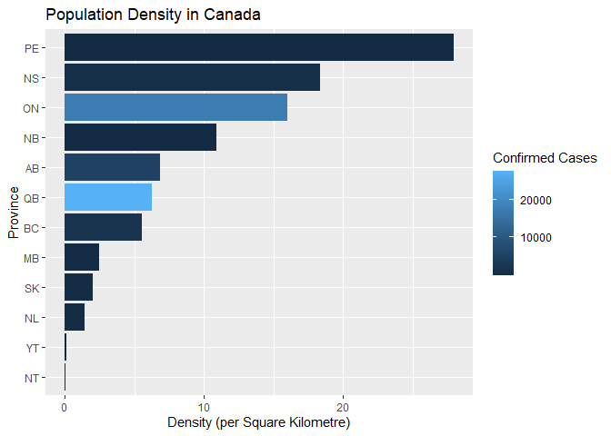<!-- -->

``` r
confirmed %>%
  mutate(
    `Cases/Density` = cases / (Population / Area),
    Province = fct_reorder2(Province, date, `Cases/Density`)
  ) %>%
  ggplot(aes(x = date, y = `Cases/Density`)) +
  geom_line(aes(color = Province)) +
  labs(
    title = "COVID-19 Confirmed Cases per Density in Canada",
    x = "Date",
    y = "Confirmed Cases per Density"
  ) +
  scale_y_continuous(labels = label_number_si())
```

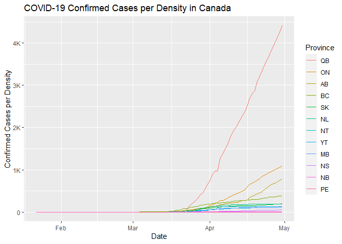<!-- -->

Now, if we take into account both land area and population or density,
we see that Quebec still has the highest rate, followed by Ontario,
Alberta, and British Columbia. This means that it is very way more
likely to get infected in Quebec than in Ontario or Alberta.
Interestingly, Prince Edward Island and Nova Scotia which are the top
two provinces with the highest population density do not have high
confirmed cases considering their high population densities.

## Analysis (Box-Jenkins Methodology)

In this section, I will use the Box-Jenkins methodology to forecast the
spread of COVID-19 in British Columbia using the last 50 observations
(12 Mar. 2020 to 30 Apr. 2020).

### Model Indentification

``` r
confirmed <- confirmed %>%
  filter(Province == "BC", date >= mdy("03/12/20")) %>%
  select(Province, date, cases)
head(confirmed)
```

    ## # A tsibble: 6 x 3 [1D]
    ## # Key:       Province [1]
    ##   Province date       cases
    ##   <fct>    <date>     <int>
    ## 1 BC       2020-03-12    46
    ## 2 BC       2020-03-13    64
    ## 3 BC       2020-03-14    64
    ## 4 BC       2020-03-15    73
    ## 5 BC       2020-03-16   103
    ## 6 BC       2020-03-17   103

#### Time Series, ACF, and PACF Plots

``` r
gg_tsdisplay(confirmed, cases, plot_type = "partial") + labs(title = "Ensemble of Time Series Plots")
```

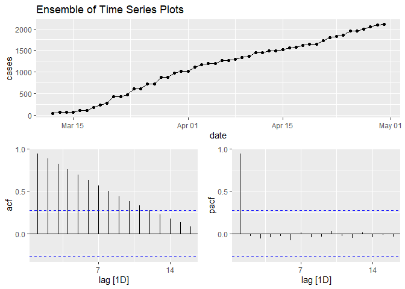<!-- -->

The time series is mostly likely non-stationary as we can see an obvious
increasing trend.

Let’s use the first differencing to eliminate the trend. Additionally, I
will only use non-zero observations.

#### First Differenced Time Series, ACF, and PACF plots

``` r
first_diff <- confirmed %>%
  mutate(cases = difference(cases)) %>%
  filter(!is.na(cases))
gg_tsdisplay(first_diff, cases, plot_type = "partial") + labs(title = "Ensemble of First Differenced Time Series Plots")
```

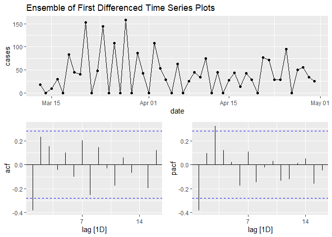<!-- -->

The series seems to closer to stationary as we can see that the mean
varies less. However, it is still unclear as to whether the series is
stationary or not.

We see that the ACF cuts off at lag 1 and PACF cuts of at lag 1. Even
though the PACF value at lag 3 is significant, we can generally see that
after lag 1 both ACF and PACF values decay quickly.

##### Augmented Dickey-Fuller Test

Let’s test whether the first differenced time series is stationary.

``` r
first_diff %>%
  pull(cases) %>%
  as.ts() %>%
  adf.test()
```

    ## 
    ##  Augmented Dickey-Fuller Test
    ## 
    ## data:  .
    ## Dickey-Fuller = -3.037, Lag order = 3, p-value = 0.1592
    ## alternative hypothesis: stationary

Since the p-value (0.1592) is greater than 0.05, we do not have
sufficient evidence to reject the null hypothesis that the series has a
unit root. Thus, it might not be stationary.

#### Second Differenced Time Series, ACF, and PACF plots

``` r
second_diff <- first_diff %>%
  mutate(cases = difference(cases)) %>%
  filter(!is.na(cases))
gg_tsdisplay(second_diff, cases, plot_type = "partial") + labs(title = "Ensemble of Second Differenced Time Series Plots")
```

<!-- -->

The series seems to be stationary as we can it has a constant mean close
to zero.

The ACF cuts of at lag 1 and the PACF cuts of at lag 2, one possible
model would be ARIMA(2, 2, 0).

##### Augmented Dickey-Fuller Test

Let’s test whether the first differenced time series is stationary.

``` r
second_diff %>%
  pull(cases) %>%
  as.ts() %>%
  adf.test()
```

    ## Warning in adf.test(.): p-value smaller than printed p-value

    ## 
    ##  Augmented Dickey-Fuller Test
    ## 
    ## data:  .
    ## Dickey-Fuller = -5.5866, Lag order = 3, p-value = 0.01
    ## alternative hypothesis: stationary

Since the p-value (\< 0.01) is less than 0.05, we have sufficient
evidence to reject the null hypothesis that the series has a unit root.
Thus, the second differenced series is likely to be stationary.

### Modeling & Estimation

#### Time Series Cross Validation

``` r
results <- data.frame(matrix(nrow = 0, ncol = 3, dimnames = list(c(), c("p", "q", "CV RMSE"))))
for (p in 1:4) {
  for (q in 0:4) {
    # Fold
    confirmed_tr <- confirmed %>%
      slice(1:(n() - 1)) %>%
      stretch_tsibble(.init = 3, .step = 1)
    # Forecast
    fc <- confirmed_tr %>%
      model(ARIMA(cases ~ 1 + pdq(p, 2, q) + PDQ(0, 0, 0))) %>%
      forecast(h = 1)
    # Accuracy
    rmse <- fc %>%
      accuracy(confirmed) %>%
      select(RMSE)
    # Save results
    results[(nrow(results) + 1), ] <- c(p, q, rmse)
  }
}
```

#### CV RSME

``` r
results %>%
  as_tibble() %>%
  arrange(CV.RMSE)
```

    ## # A tibble: 20 x 3
    ##        p     q CV.RMSE
    ##    <int> <int>   <dbl>
    ##  1     4     0    37.0
    ##  2     2     0    39.0
    ##  3     3     0    40.1
    ##  4     4     1    44.9
    ##  5     2     4    45.9
    ##  6     2     2    46.1
    ##  7     1     1    46.4
    ##  8     1     4    47.1
    ##  9     3     1    48.1
    ## 10     2     3    48.2
    ## 11     3     4    48.9
    ## 12     3     2    49.0
    ## 13     1     2    49.4
    ## 14     3     3    49.8
    ## 15     1     3    51.7
    ## 16     1     0    52.4
    ## 17     2     1    52.8
    ## 18     4     2    53.3
    ## 19     4     4    54.4
    ## 20     4     3    55.2

### Diagnostic Checking

#### Fit Best Model

``` r
mable <- model(confirmed, ARIMA(cases ~ 1 + pdq(4, 2, 0) + PDQ(0, 0, 0)))
```

    ## Warning: Model specification induces a quadratic or higher order polynomial trend. 
    ## This is generally discouraged, consider removing the constant or reducing the number of differences.

``` r
mable
```

    ## # A mable: 1 x 2
    ## # Key:     Province [1]
    ##   Province `ARIMA(cases ~ 1 + pdq(4, 2, 0) + PDQ(0, 0, 0))`
    ##   <fct>                                             <model>
    ## 1 BC                                 <ARIMA(4,2,0) w/ poly>

#### Residual Analysis

``` r
gg_tsresiduals(mable) + labs(title = "Time Series Residual Plots")
```

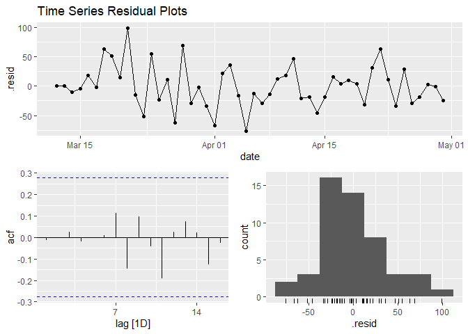<!-- -->

``` r
p_values <- as.numeric(
  sapply(1:10, function(x) ljung_box(residuals(mable)$.resid, lag = x)[2])
)
ljung <- data.frame(Lag = 1:10, p_values = p_values)
ggplot(ljung) +
  geom_point(aes(x = Lag, y = p_values)) +
  labs(title = "P-values for Ljung-Box statistic", y = "P-values") +
  ylim(c(0, 1))  
```

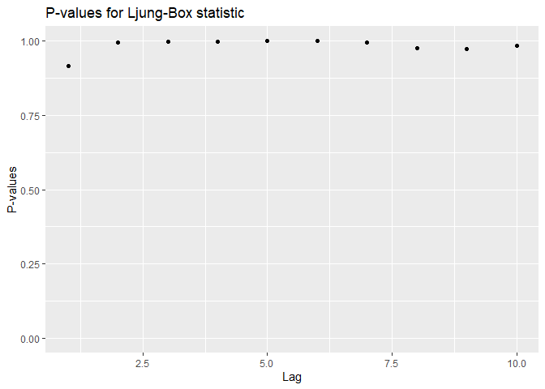<!-- -->

We can see that there is no pattern apparent in the residuals analysis
plot. The ACF values are not significant for lags other than 0. The
p-values for the Ljung-Box test are also large suggesting nothing
untoward about the fit of the model. Hence, I will use the ARIMA(4,2,0)
to forecast the next 7 confirmed cases in British Columbia (May 1st,
2020 to May 7th, 2020).

### Forecast

``` r
mable %>%
  forecast(h = 7) %>%
  autoplot(confirmed) +
  labs(
    title = "COVID-19 Confirmed Cases in BC Forecast",
    x = "Date",
    y = "Confirmed Cases"
  )
```

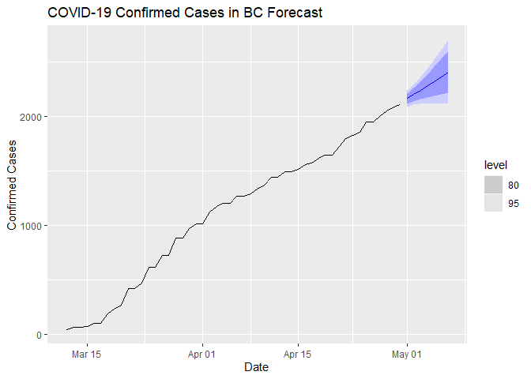<!-- -->

### Conclusion

Forecasting the spread of a pandemic is difficult. We might understand
the factors that contribute to it, but we know that the data is limited
and can be misleading. It is known that the data is currently
underestimating the real count and we know that different countries are
handling the pandemic differently. Thus, the data from countries that
are not testing rigorously would be less accurate than those coming from
countries that are testing rigorously. Furthermore, the media affects
how people behave and how the virus spreads. We did not take that into
account here.

I do not think it’s impossible to accurately model a pandemic spread.
One example would be the [compartmental models in
epidemiology](https://en.wikipedia.org/wiki/Compartmental_models_in_epidemiology).
One of the simplest models is the SIR model. All in all, I believe that
Time Series models are still accurate on applications where the
conditions for them to perform well are met.
